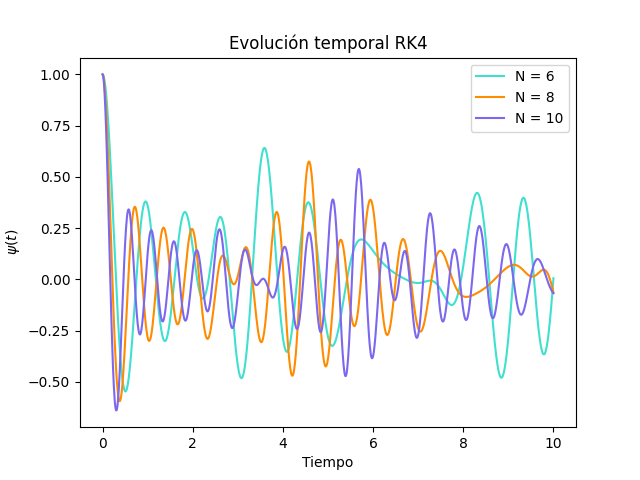
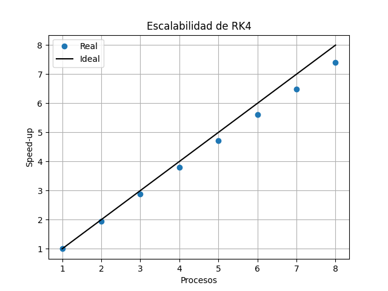

Se implementó el método de Runge-Kutta de orden 4 para los mismos N que en Python, es decir, 6, 8 y 10. Así, a continuación se presenta la gráfica con la evolución temporal del sistema que compara los N:

El tiempo obtenido en la evolución para N = 10 fue de 199.38s, para N = 8 de 11.00s y para N = 6 de 0.70s. 

Por otro lado, se paralelizó por medio de OpenMP (memoria compartida) la función *derivadaVectorPsi*, de manera que se probó la escalabilidad del programa hasta con 8 procesos o hilos para N = 10. La siguiente gráfica muestra la aceleración ideal del programa comparada con la real:

