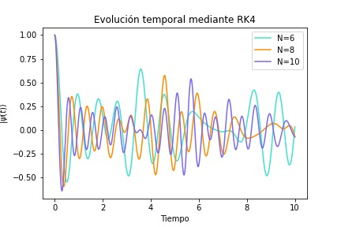
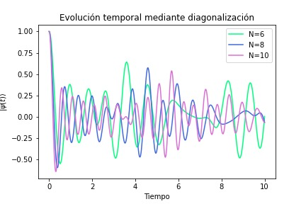

Se recurrieron a dos métodos para implementar la solución numérica del problema ya presentado. Se utilizó el método de Runge-Kutta de orden 4 para calcular la evolución temporal del sistema y seguidamnete se implementó la diagonalización para evaluar la solución directa ya dada. Así, se evaluó la evolución para distintos valores de N.

A continuación se presenta una gráfica comparativa para los distintos N (8, 9 y 10) obtenida a partir del método RK4, donde el tiempo obtenido para N = 10 fue de 34.71s, para N = 8 de 1.90s y para N = 6 de 0.06s:
 

Por otro lado, se presenta la comparación para los mismos valores de N graficados anteriormente, pero con el método de la diagonalización implementado, donde el tiempo obtenido para N = 10 fue de 17.37s, para N = 8 de 0.95s y para N = 6 de 0.42s:

